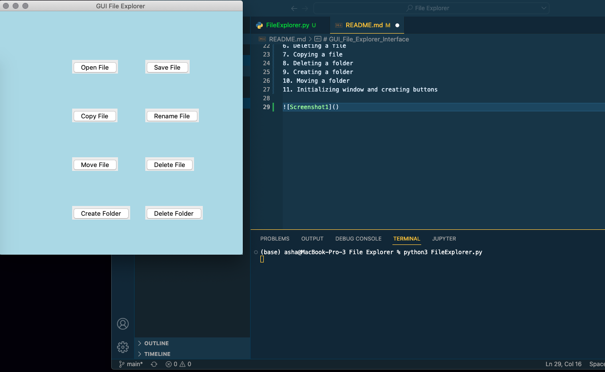

# GUI_File_Explorer_Interface

Every computer has a file manager, i.e. File Explorer or Finder.  Having a GUI (graphical user interface) helps to access files.  

This GUI file manager allows the user to save, open, rename, delete and move files and will also help in creating and deleting the folder.

These are imported:

tkinter: It is the most used Graphical User Interface package in python.
filedialog: While working with files, filedialog provides a set of dialogs.
easygui: It is the most easy Graphical User Interface module. This module is not event driven.
os: When different files are processed from different locations.
messagebox: Message boxes are displayed with the help of messagebox.

Project File Structure

1. Installing tkinter(TK) and easygui
2. Importing libraries
3. Save the File
4. Open the File
5. Renaming the file
6. Deleting a file
7. Copying a file
8. Deleting a folder
9. Creating a folder
10. Moving a folder
11. Initializing window and creating buttons

